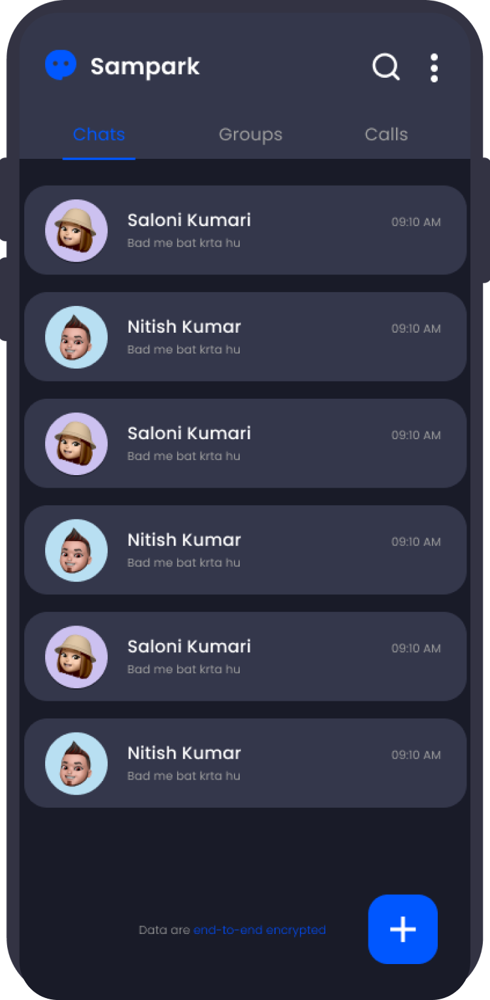
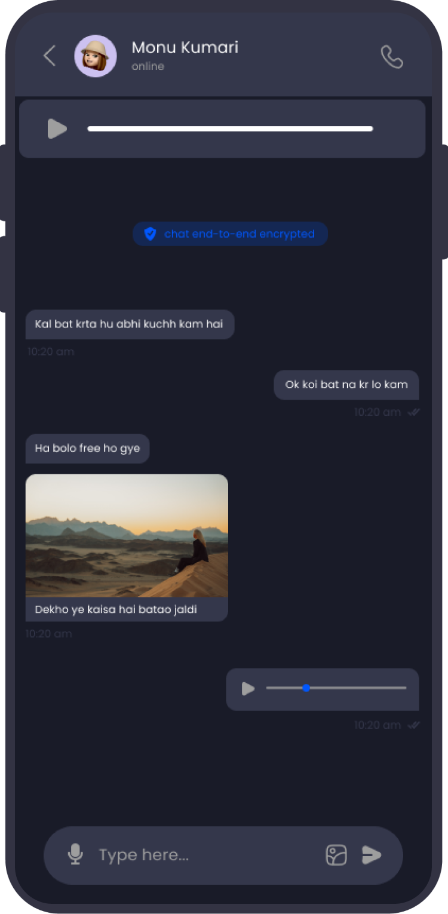
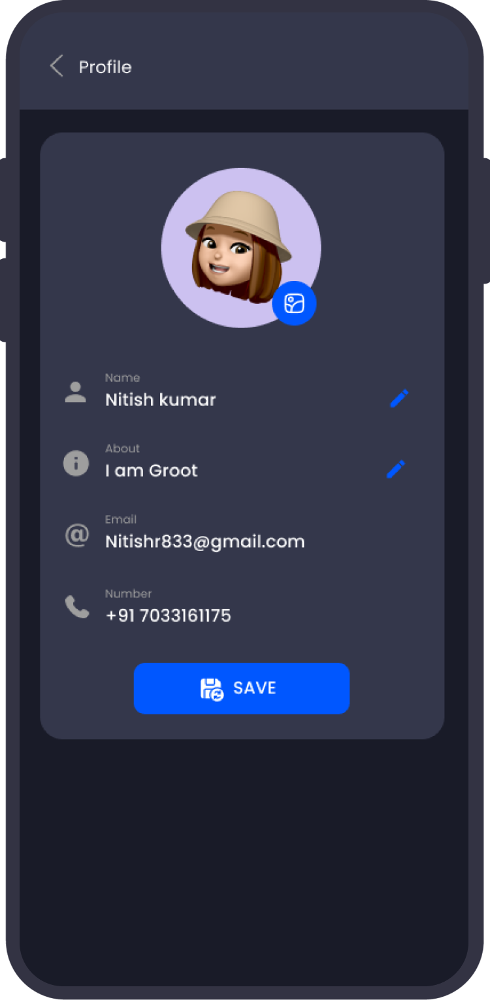
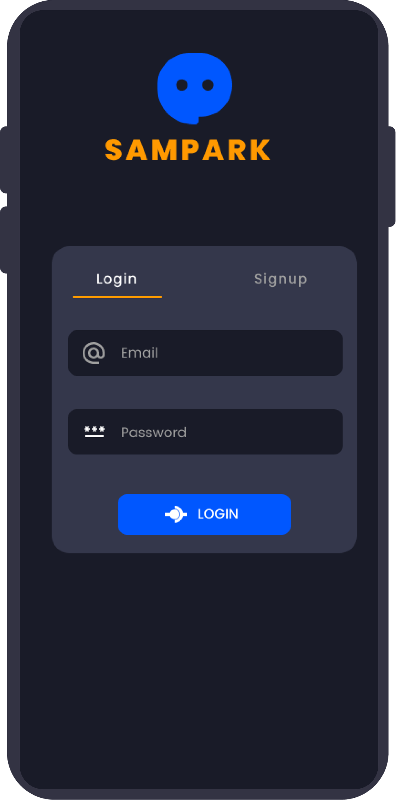

<div align="center">

# SAMPARK — Connect & Chat

Modern Flutter landing site for the Sampark Android app with responsive web UI, feature highlights, and direct APK downloads via GitHub Releases.

[](https://flutter.dev) [](https://dart.dev) [](https://pub.dev/packages/get) [](#license) [](https://github.com/dd-18/sampark_web) [](https://github.com/dd-18/sampark_web/issues)

</div>

---

### Overview
This repository contains the Flutter web app for the Sampark project — a simple, fast, and responsive landing website to showcase app features and provide a one-click APK download. It supports both web and mobile layouts with a dark theme and Poppins typography.
Repository: [dd-18/sampark_web](https://github.com/dd-18/sampark_web)


The site automatically checks the latest release version from GitHub and updates the CTA accordingly.

### Key Features
- Real-time messaging, read receipts, and presence copy
- HD voice and video call highlights
- Group management and cross-platform messaging highlights
- Responsive layout: dedicated mobile and web UIs
- Auto version check from GitHub Releases and instant APK download
- Screenshots carousel for app previews

### Tech Stack
- Flutter (Material 3, dark theme)
- Dart 3
- GetX for state management and reactivity
- `http` for GitHub API
- `url_launcher` for opening release links
- `google_fonts` for typography

### Screenshots
The UI displays app screenshots located under `assets/images`:







> Note: Images are loaded directly from local assets in the running app; GitHub might not render large images inline in the README.

---

## Project Structure
```
lib/
  Config/
    Colors.dart           # Color constants for dark theme
    ResponsiveLayout.dart # Switches between mobile and web UIs
    Themes.dart           # Light/Dark theme definitions (Material 3)
  Controller/
    AppController.dart    # Version check, APK download, GitHub Releases API
  Pages/
    MobileHomePage.dart   # Mobile-first landing page
    WebHomePage.dart      # Desktop/web landing page
  View/
    HomePageView.dart     # Entry view using ResponsiveLayout
  Widgets/
    Divider.dart
    MainInfo.dart         # Hero section with download CTA
    ScreenShot.dart       # Screenshot scroller
    WebFeatures.dart      # Feature cards (web)
main.dart                 # App bootstrap and theme wiring
```

Assets and fonts are declared in `pubspec.yaml`:
- `assets/images/**`
- `assets/fonts/Poppins-*.ttf`

---

## Getting Started

### Prerequisites
- Flutter SDK 3.x installed and on PATH
- Dart SDK 3.x (bundled with Flutter)
- Git

Verify your environment:

```bash
flutter --version
dart --version
```

### Setup
```bash
git clone https://github.com/dd-18/sampark_web.git
cd sampark_web
flutter pub get
```

### Run (Web or Device)
```bash
# Run in Chrome
flutter run -d chrome

# Or list devices and pick one
flutter devices
flutter run -d <device_id>
```

### Build
```bash
# Web (outputs to build/web)
flutter build web --release

# Android APK
flutter build apk --release

# Android App Bundle
flutter build appbundle --release

# Desktop (if enabled)
flutter build windows --release
flutter build macos --release
flutter build linux --release
```

### Deploy (Web)
Upload the contents of `build/web` to any static host (GitHub Pages, Netlify, Vercel, Cloudflare Pages, etc.). For GitHub Pages, you can serve from `gh-pages` branch or `/docs`.

---

## How Version Check and Download Work
- `Controller/AppController.dart` calls the GitHub Releases API:
  - `GET https://api.github.com/repos/<owner>/<repo>/releases/latest`
  - Extracts `tag_name` and `assets[].browser_download_url`
- The UI binds to `oldVersion` via GetX and displays the version in CTAs
- Clicking the Download button triggers a browser download using an injected anchor element

You can change the release source by updating in `AppController`:
- Repository owner and name
- Fallback `appUrl`/`apkName`

---

## Configuration
No runtime secrets are required. All calls are public GitHub APIs. Ensure assets and fonts paths in `pubspec.yaml` match the files under `assets/`.

---

## Contributing
1. Fork the repository
2. Create a feature branch: `git checkout -b feat/your-feature`
3. Commit your changes: `git commit -m "feat: add your feature"`
4. Push the branch: `git push origin feat/your-feature`
5. Open a Pull Request

---

## License
No license file found in this repository. If you intend to make it open source, consider adding a license (e.g., MIT). Until then, assume all rights reserved.

---

## Acknowledgements
- Flutter team for the framework and docs
- GetX, google_fonts, url_launcher, http packages


